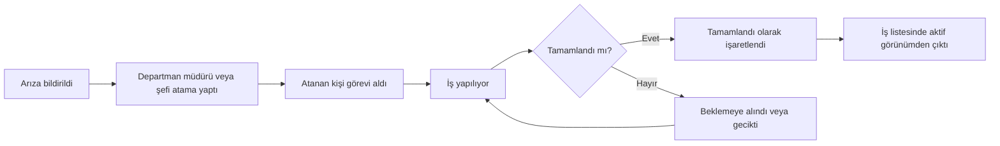
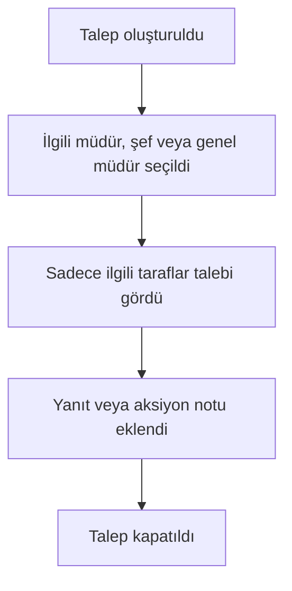
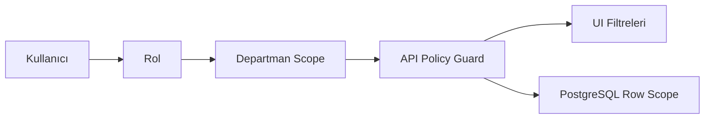

# Workflow Tasarımları

## Arıza Akışı

Her adım `WorkOrderTimeline` tablosuna kullanıcı, tarih/saat, eski/yeni durum ve metadata ile yazılır.

## Talep Akışı

## Departman Görünürlüğü

## Audit ve Soft Delete

- Silme işlemleri fiziksel silme değildir; `deletedAt` set edilir.
- Kritik update öncesi/sonrası JSON snapshot `AuditLog.before` ve `AuditLog.after` alanlarına yazılır.
- IP, user agent, session ve actor bilgisi her aksiyonda saklanır.
